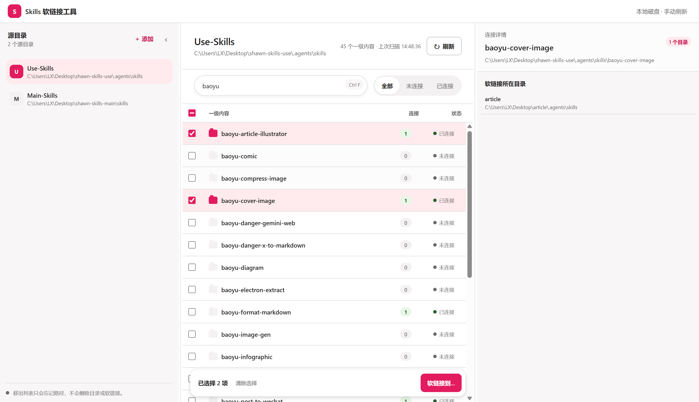

# Skills Soft Link

一个用于管理 Skills 软链接的 Windows 桌面应用。

选择源目录和目标目录后，应用会将源目录下的一级子目录（每个 Skills 目录）软链接到目标目录中，无需复制文件。

> 目前仅支持 Windows。

## 项目截图



## 命令

```bash
# 本机启动开发联调
npm run dev

# 打包
npm run build
```

## 版本发布

在项目根目录执行以下命令，可递增补丁版本号、同步 Tauri 与 Rust 的版本号并打包：

```powershell
npm version patch --no-git-tag-version

node -e 'const fs=require("fs"); const version=require("./package.json").version; const configPath="src-tauri/tauri.conf.json"; const config=JSON.parse(fs.readFileSync(configPath,"utf8").replace(/^\uFEFF/,"")); config.version=version; fs.writeFileSync(configPath,JSON.stringify(config,null,2)+"\n","utf8"); const cargoPath="src-tauri/Cargo.toml"; let cargo=fs.readFileSync(cargoPath,"utf8").replace(/^\uFEFF/,""); cargo=cargo.replace(/^version\s*=\s*"[^"]+"/m,`version = "${version}"`); fs.writeFileSync(cargoPath,cargo,"utf8"); console.log(`版本已同步为 ${version}`);'

npm run build
```
